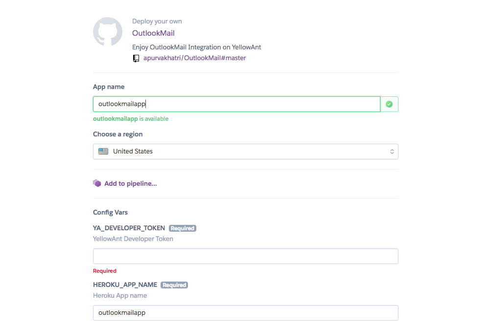

The application is developed on Python3.

Requirements:
NGROK
Account on Yellowant
Microsoft Developer account

Steps to run the application on your system:
Step1:
Create a python virtual environment

```python3 -m virtualenv env```

Activate the environment

```source testapp/bin/activate```

Install all the requirements

```pip install -r requirements.txt```


Step2:
Change the BASE_URL, OUTLOOK_CLIENT_ID, OUTLOOK_CLIENT_SECRET in OutlookMail/outlookapp/settings.py

(Line Number: 40) to OUTLOOK_CLIENT_ID + "/"
Example : OUTLOOK_CLIENT_ID = "ffewfew5b4-0498-4ea4-9774-2efwwfe5ffe77"
(Line Number: 41) to OUTLOOK_CLIENT_SECRET
Example : OUTLOOK_CLIENT_SECRET = "scmgtTFJ2}zf214dc{#)"
(Line Number: 42) to NGROK url + "/"
Example : BASE_URL = "https://59efbf61.ngrok.io/"

Change api_url, redirect_uris in OutlookMail/yellowant_app.yaml

(Line Number: 1) to api_url
Example : api_url = "https://59efbf61.ngrok.io/apiurl/"
(Line Number: 199) to redirect_uris
Example : redirect_uris = "https://59efbf61.ngrok.io/redirecturl/"

Change Redirect URLs on Microsoft Developer application to:
"https://59efbf61.ngrok.io/outlookredirecttoken/"

Step3:
Run

```yellowant auth```

```yellowant sync -q```

Step4:

Create Database then Make Migrations and finally create a superuser
```create database <databasename as defined in settings.py>```
```python manage.py makemigration```
```python manage.py migrate```
```python manage.py createsuperuser```

Step5:
Run
```python manage.py runserver```

Step6:
Log in to Django-admin at NGROK_URL + "/admin/"
Example: "https://59efbf61.ngrok.io/admin/"

Step7:


# HEROKU DEPLOYMENT
# OutlookMail
[](https://heroku.com/deploy)

Go to YellowAnt developers page and click on Generate Developer Token to get "YA_DEVELOPER_TOKEN"


"HEROKU_APP_NAME" should be same as "App name"



"OM_CLIENT_ID", "OM_CLIENT_SECRET" is to be obtained from microsoft developers account

Change "Redirect URLs" on microsoft developers account to "https://<appname>.herokuapp.com/outlookredirecttoken/"

## DO NOT ALTER - "DISABLE_COLLECTSTATIC" and "ENV"

After deployment click on "View" and change the URL to /admin/. Example: https://<app-name>.herokuapp.com/admin/


Username: admin

Password: pass
  
### We request the user to change the ID AND PASSWORD

