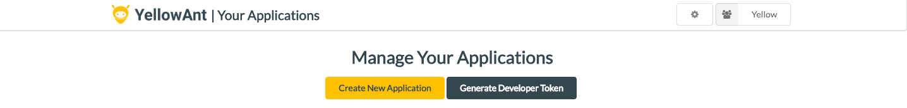

# OutlookMail

Go to YellowAnt developers page and click on Generate Developer Token to get "YA_DEVELOPER_TOKEN"

"HEROKU_APP_NAME" should be same as "App name"

"OM_CLIENT_ID", "OM_CLIENT_SECRET" is to be obtained from microsoft developers account

## DO NOT ALTER - "DISABLE_COLLECTSTATIC" and "ENV"

